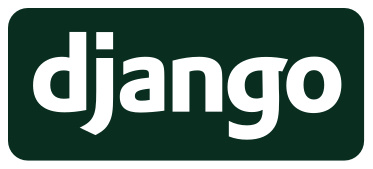

######
Django
######

`Django`_ es un framework de desarrollo web de alto nivel, gratuito y de código abierto, **escrito en Python**. Se utiliza para crear aplicaciones web de forma rápida y segura, ya que proporciona una estructura lista para usar, incluyendo funcionalidades comunes como autenticación de usuarios, administración de contenido, mapas del sitio, entre otros. Django es altamente escalable y puede manejar miles de solicitudes, y su arquitectura está diseñada para utilizar eficientemente el hardware del sistema. Además, ofrece características avanzadas de seguridad y es ampliamente utilizado en la industria. Fue creado por `Adrian Holovaty`_ y `Simon Willison`_ en 2005.

****************
¿Por qué Django?
****************

El nombre "Django" fue elegido en honor al músico de jazz `Django Reinhardt`_. Django Reinhardt fue un guitarrista y compositor belga de origen gitano que es considerado uno de los músicos más influyentes en la historia del jazz europeo. Fue famoso por su estilo único de tocar la guitarra y por su contribución al desarrollo del jazz en la década de 1930 y 1940.

Los desarrolladores originales de Django, Adrian Holovaty y Simon Willison, eran fanáticos de la música de Django Reinhardt y decidieron nombrar el framework en su honor. El nombre refleja la pasión de los desarrolladores por la música y, al mismo tiempo, transmite la idea de creatividad, innovación y excelencia, valores que también se reflejan en el framework Django.

.. figure:: images/django-reinhardt.jpg
    :align: center

    Django Reinhardt

*********
Versiones
*********

A continuación se muestran las versiones mayores de Django con su año de lanzamiento:

.. csv-table:: Versiones mayores de Django
    :file: tables/django-releases.csv
    :header-rows: 1

***************
Características
***************

Estas son solo algunas de las características principales de Django que hacen que sea **uno de los frameworks web más populares y potentes disponibles en el ecosistema de desarrollo web de Python**:

Diseño basado en el principio de "baterías incluidas":
    Django viene con una variedad de características integradas para ayudar en el desarrollo web, como un ORM (Mapeador Objeto-Relacional) potente para interactuar con la base de datos, un sistema de administración de contenido, autenticación de usuarios, formularios web, entre otros.

Patrón de diseño Modelo-Vista-Controlador (MVC):
    Django sigue un patrón de diseño MVC, aunque lo llama "Modelo-Template-Vista" (MTV). Esto proporciona una estructura organizativa para el código, lo que facilita el mantenimiento y la escalabilidad de las aplicaciones.

ORM (Mapeador Objeto-Relacional):
    Django incluye su propio ORM que permite interactuar con la base de datos utilizando objetos Python en lugar de consultas SQL directas. Esto simplifica el acceso y la manipulación de datos, al tiempo que ayuda a prevenir vulnerabilidades como la inyección SQL.

Sistema de plantillas robusto:
    Django proporciona un sistema de plantillas para generar HTML dinámico de manera eficiente y segura. Este sistema permite la separación limpia de la lógica de presentación y el código de la aplicación.

Administrador de Django:
    Django incluye un potente sistema de administración que genera automáticamente una interfaz de administración basada en la configuración del modelo de datos. Esto facilita la gestión y el mantenimiento de los datos de la aplicación sin necesidad de escribir código adicional.

Seguridad integrada:
    Django se preocupa por la seguridad y viene con características integradas para proteger las aplicaciones web contra vulnerabilidades comunes, como la protección contra ataques de inyección de código SQL, ataques de Cross-Site Scripting (XSS), entre otros.

Escalabilidad y rendimiento:
    Django está diseñado para ser escalable y manejar aplicaciones de cualquier tamaño. Ofrece herramientas para caché de datos, fragmentación de caché, almacenamiento en caché de consultas de base de datos y otras técnicas para mejorar el rendimiento de las aplicaciones.

Soporte para internacionalización y localización:
    Django facilita la creación de aplicaciones web multilingües gracias a su soporte integrado para la internacionalización y la localización. Esto permite que las aplicaciones se adapten a diferentes idiomas y regiones de forma sencilla.

.. --------------- Hyperlinks ---------------

.. _Django: https://www.djangoproject.com/
.. _Adrian Holovaty: https://es.wikipedia.org/wiki/Adrian_Holovaty
.. _Simon Willison: https://es.wikipedia.org/wiki/Simon_Willison

******************
¿Quién usa Django?
******************

Grandes empresas y sitios destacados que utilizan Django incluyen:

- Instagram
- NASA
- Spotify
- Dropbox
- Mozilla
- The Washington Post
- Reddit
- Udemy
- Pinterest
- National Geographic

Estas empresas confían en Django debido a su alta calidad, seguridad y funcionalidades, respaldadas por una sólida infraestructura de soporte y una comunidad activa.

.. --------------- Hyperlinks ---------------

.. _Django Reinhardt: https://es.wikipedia.org/wiki/Django_Reinhardt
