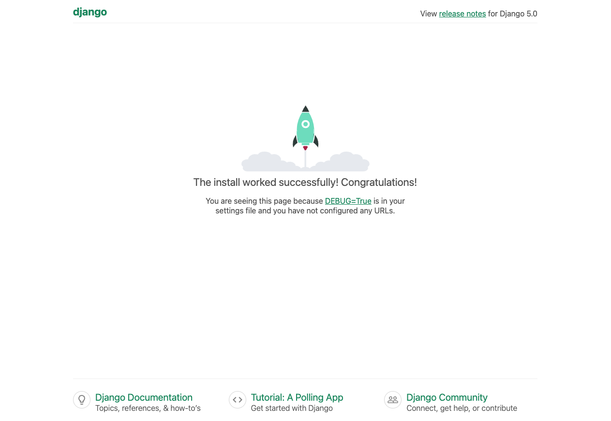
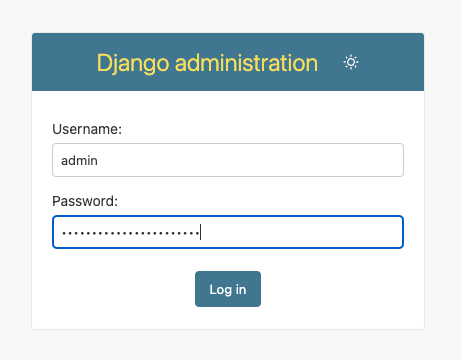
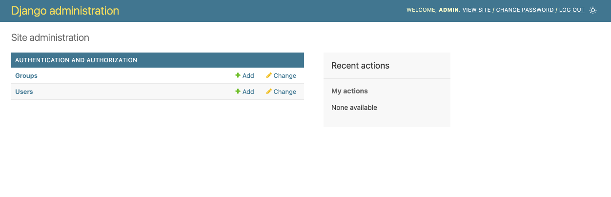

################
Puesta en marcha
################

De aquí en adelante trabajaremos sobre un mismo proyecto web que irá creciendo y añadiendo nuevas herramientas a medida que vayamos viendo nuevas secciones.

Este proyecto se denomina **Musicalia** :fa:`music` y pretende ser una plataforma (ficticia) de gestión de canciones, donde podrás compartir, valorar, comentar e incluso "comprar" tu música favorita.

En esta sección se explicará cómo poner en marcha un proyecto Django.

.. warning::
    La explicación se basará en sistema operativo **Linux**.

***************
Entorno virtual
***************

Primero vamos a crear una carpeta ``musicalia`` donde estará el código de nuestro proyecto:

.. code-block:: console

    $ mkdir musicalia && cd musicalia

A continuación creamos un `entorno virtual`_ donde empaquetar todas las dependencias Python de nuestro proyecto:

.. code-block:: console

    $ python -m venv .venv --prompt musicalia

Para activar el entorno virtual usamos el script ``activate`` del siguiente modo:

.. code-block:: console

    $ source .venv/bin/activate

.. tip::
    Cuando activamos el entorno virtual nos aparece delante del "prompt" el nombre del entorno virtual **entre paréntesis**.
    
***********
Instalación
***********

Django es un `paquete de Python <https://pypi.org/project/Django/>`_ que podemos instalar normalmente con ``pip``:

.. code-block:: console

    $ pip install django

.. caution::
    Importante haber activado el :ref:`entorno virtual <chapter1/setup:entorno virtual>` previo a instalar cualquier paquete.

*********************
Creación del proyecto
*********************

Un proyecto Django es una estructura de directorios y archivos que ofrecen funcionalidades web.

Para crear el proyecto, o mejor dicho, para crear el "scaffolding" (andamiaje) del proyecto, debemos lanzar el siguiente comando:

.. code-block:: console

    $ django-admin startproject musicalia .

.. attention::
    Recordar siempre estar en la carpeta de trabajo (``musicalia`` en este caso) y tener el entorno virtual activado.

Si echamos un vistazo ahora al contenido de la carpeta ``musicalia`` nos encontramos con los siguientes archivos y carpetas:

.. code-block::

    .
    ├── manage.py
    └── musicalia
        ├── __init__.py
        ├── asgi.py
        ├── settings.py
        ├── urls.py
        └── wsgi.py

Veamos para qué sirve cada uno de estos componentes:

:fa:`cube` ``manage.py``
    Este archivo sirve como una interfaz en línea de comandos para realizar diversas tareas como ejecutar el servidor de desarrollo, gestionar la base de datos, ejecutar pruebas y realizar tareas personalizadas.

:fa:`cube` ``musicalia/__init__.py``
    Es un archivo sirve como "placeholder" para indicar que la carpeta ``musicalia`` es un módulo, aunque en versiones "modernas" de Python ya no es necesario incluir este tipo de archivos.

:fa:`cube` ``musicalia/asgi.py``
    Este archivo sirve como punto de entrada para el servidor ASGI (Asynchronous Server Gateway Interface) utilizado para manejar comunicaciones asíncronas en aplicaciones web.

:fa:`cube` ``musicalia/settings.py``
    Este archivo sirve para configurar y personalizar el proyecto, incluyendo la base de datos, las aplicaciones instaladas, las rutas de archivos estáticos, las claves secretas, entre otros ajustes.

:fa:`cube` ``musicalia/urls.py``
    Este archivo sirve para mapear las URLs *de primer nivel* del proyecto a las vistas o aplicaciones correspondientes, determinando cómo se manejan las solicitudes entrantes.

:fa:`cube` ``musicalia/wsgi.py``
    Este archivo sirve como punto de entrada para el servidor WSGI (Web Server Gateway Interface) utilizado para manejar comunicaciones síncronas en aplicaciones web.

**************
Requerimientos
**************

Es altamente recomendable incluir un fichero ``requirements.txt`` indicando los requerimientos Python de nuestro proyecto Django.

De momento sólo tenemos un requerimiento (dependencia) que sería ``django``:

.. code-block:: console

    $ echo Django > requirements.txt

También es posible fijar ("pinear") la versión concreta que estamos utilizando, para no tener problemas en caso de volver a recrear el entorno virtual.

En este caso, primero debemos localizar la versión instalada de Django:

.. code-block:: console

    $ pip freeze | grep -i django
    Django==5.0.1

.. tip::
    Otra forma de obtener información sobre un paquete Python instalada es usar el comando ``pip show django``.

Y ahora tendríamos que añadir dicha información al fichero de requerimientos:

.. code-block:: console

    $ echo 'Django==5.0.1' > requirements.txt

También podemos hacerlo todo de una vez usando el siguiente comando:

.. code-block:: console

    $ echo `pip freeze | grep -i django` > requirements.txt

**********************
Servidor de desarrollo
**********************

El servidor de desarrollo de Django es una herramienta integrada que permite ejecutar y probar aplicaciones web localmente durante el desarrollo. Utiliza un servidor ligero y proporciona funcionalidades de recarga automática para facilitar la iteración rápida en el desarrollo de aplicaciones.

Si probamos a lanzarlo nos encontramos con lo siguiente:

.. code-block:: console

    $ python manage.py runserver
    Watching for file changes with StatReloader
    Performing system checks...

    System check identified no issues (0 silenced).

    You have 18 unapplied migration(s). Your project may not work properly until you apply the migrations for app(s): admin, auth, contenttypes, sessions.
    Run 'python manage.py migrate' to apply them.
    February 05, 2024 - 17:33:10
    Django version 5.0.1, using settings 'musicalia.settings'
    Starting development server at http://127.0.0.1:8000/
    Quit the server with CONTROL-C.

Analicemos la salida parte por parte:

    :fa:`quote-left` Watching for file changes with StatReloader :fa:`quote-right`

Esto significa que el proceso está pendiente de "cualquier" cambio en los ficheros del proyecto para recargar el servidor de desarrollo.

    :fa:`quote-left` Performing system checks...

    System check identified no issues (0 silenced). :fa:`quote-right`

Esto significa que se han realizado chequeos en el proyecto y no se ha detectado ninguna incidencia. Esta comprobación también la podemos lanzar explícitamente con el comando ``python manage.py check``.

    :fa:`quote-left` You have 18 unapplied migration(s). Your project may not work properly until you apply the migrations for app(s): admin, auth, contenttypes, sessions.

    Run 'python manage.py migrate' to apply them. :fa:`quote-right`

Esto significa que tenemos migraciones pendientes de aplicar. Las migraciones se verán en la próxima sección.

    :fa:`quote-left` February 05, 2024 - 17:33:10 :fa:`quote-right`

Fecha y hora actuales.

    :fa:`quote-left` Django version 5.0.1, using settings 'musicalia.settings' :fa:`quote-right`

Esto significa que estamos usando la versión 5.0.1 de Django con la configuración del proyecto en el fichero ``musicalia/settings.py``.

    :fa:`quote-left` Starting development server at http://127.0.0.1:8000/

    Quit the server with CONTROL-C. :fa:`quote-right`

Esto significa que se ha levantado el servidor de desarrollo en el **puerto 8000** de nuestra máquina (``127.0.0.1`` o ``localhost``). Podemos parar el servidor de desarrollo pulsando :kbd:`Ctrl-C`.

    Pantalla de inicio del servidor de desarrollo de Django

Migraciones iniciales
=====================

Hemos visto que Django solicita aplicar migraciones pendientes. Esto se debe a que necesita crear una serie de tablas en la base de datos para poder funcionar de manera adecuada.

Para aplicar las migraciones pendientes ejecutamos el siguiente comando:

.. code-block:: console

    $ python manage.py migrate
    Operations to perform:
      Apply all migrations: admin, auth, contenttypes, sessions
    Running migrations:
      Applying contenttypes.0001_initial... OK
      Applying auth.0001_initial... OK
      Applying admin.0001_initial... OK
      Applying admin.0002_logentry_remove_auto_add... OK
      Applying admin.0003_logentry_add_action_flag_choices... OK
      Applying contenttypes.0002_remove_content_type_name... OK
      Applying auth.0002_alter_permission_name_max_length... OK
      Applying auth.0003_alter_user_email_max_length... OK
      Applying auth.0004_alter_user_username_opts... OK
      Applying auth.0005_alter_user_last_login_null... OK
      Applying auth.0006_require_contenttypes_0002... OK
      Applying auth.0007_alter_validators_add_error_messages... OK
      Applying auth.0008_alter_user_username_max_length... OK
      Applying auth.0009_alter_user_last_name_max_length... OK
      Applying auth.0010_alter_group_name_max_length... OK
      Applying auth.0011_update_proxy_permissions... OK
      Applying auth.0012_alter_user_first_name_max_length... OK
      Applying sessions.0001_initial... OK

Ahora al lanzar el servidor de desarrollo no aparece el mensaje de las migraciones:

.. code-block:: console

    $ python manage.py runserver
    Watching for file changes with StatReloader
    Performing system checks...

    System check identified no issues (0 silenced).
    February 06, 2024 - 10:12:12
    Django version 5.0.1, using settings 'musicalia.settings'
    Starting development server at http://127.0.0.1:8000/
    Quit the server with CONTROL-C.

***********************
Interfaz administrativa
***********************

Django proporciona "out of the box" una interfaz administrativa que permite gestionar la información de la base de datos de forma muy cómoda y potente.

Lo primero que necesitamos para acceder a esta inferfaz administrativa es crear una cuenta de "super usuario" que tendrá todos los privilegios dentro del proyecto. Para ello lanzamos el siguiente comando:

.. code-block:: console

    $ python manage.py createsuperuser
    Username (leave blank to use 'sdelquin'): admin
    Email address: admin@example.com
    Password:
    Password (again):
    Superuser created successfully.

.. hint::
    Especialmente en un entorno de producción se recomienda que las contraseñas sean fuertes combinando múltiples tipos de caracteres y usando longitudes razonables.

Ahora ya podemos acceder a http://localhost:8000/admin/ y nos aparecerá la ventana de login:

    Ventana de login de la interfaz administrativa de Django

Una vez dentro podemos observar que tenemos disponibles los menús de autenticación y autorización para gestinoar usuarios y grupos (predefinido en Django):

    Panel de control de la interfaz administrativa de Django

.. --------------- Hyperlinks ---------------

.. _entorno virtual: https://docs.python.org/es/3/tutorial/venv.html

