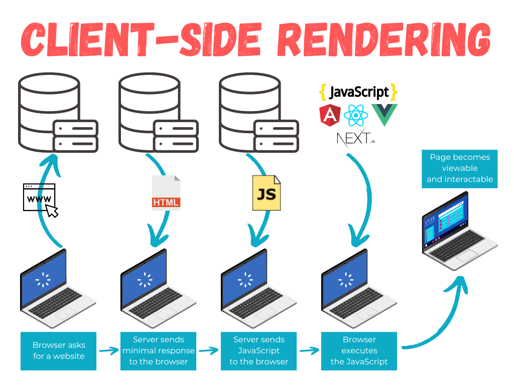

##############
Desarrollo web
##############

El "desarrollo web" es el proceso de crear y mantener sitios web. Involucra tareas como el diseño, la programación, la implementación de contenido y la configuración de servidores web. Este proceso requiere el uso de diferentes tecnologías y lenguajes de programación, como HTML, CSS, Python o JavaScript, entre otros. Además, el desarrollo web puede incluir aspectos relacionados con la identidad corporativa, el arte y la generación de ideas para la presencia digital.

************
Introducción
************

Seguro que ya sabes exactamente qué es una **página web**, e incluso conozcas cuáles son los pasos que se suceden para que, cuando visitas una web poniendo su dirección en el navegador, la página se descargue a tu equipo y se pueda mostrar. Sin embargo, este procedimiento que puede parecer sencillo, a veces no lo es tanto. **Todo depende de cómo se haya hecho la página en cuestión**.

    Comunicación cliente-servidor [#cliente-servidor]_

Cuando una **página web** se descarga al ordenador, su contenido define qué se debe mostrar en pantalla. **Este contenido está programado en un lenguaje de marcado**, formado por etiquetas, que habitualmente es **HTML**. Las etiquetas que componen la página indican el objetivo de cada una de las partes que la componen. Así, dentro de estos lenguajes hay etiquetas para indicar que un texto es un encabezado, que forma parte de una tabla, o que simplemente es un párrafo de texto.

Además, si la página está bien estructurada, la información que le indica al navegador el estilo con que se debe mostrar cada parte de la página estará almacenado en otro fichero, una **hoja de estilos** o **CSS** *(Abreviatura de "Hoja de estilos en cascada", del inglés Cascading Style Sheet - CSS)*. La hoja de estilos se encuentra indicada en la página web y el navegador la descarga junto a ésta. En ella nos podemos encontrar, por ejemplo, estilos que indican que el encabezado debe ir con tipo de letra Arial y en color rojo, o que los párrafos deben ir alineados a la izquierda.

    HTML + CSS [#html-and-css]_

Estos dos ficheros se descargan a tu ordenador desde un servidor web como respuesta a una petición. El proceso es el que se indica a continuación:

1. **Tu ordenador solicita a un servidor web** una página con extensión `.html`
2. El servidor **busca esa página** en un almacén de páginas (cada una suele ser un fichero).
3. Si el servidor encuentra esa página, **la recupera**.
4. Y por último **se la envía al navegador** para que éste pueda mostrar su contenido (renderizado).

Este es un ejemplo típico de una comunicación **cliente-servidor**. El cliente es el que hace la **petición** e inicia la comunicación, y el servidor es el que recibe la petición y la atiende mediante una **respuesta**. En este contexto, **el navegador es el cliente web**.

    Esquema de petición/respuesta HTML [#request-response]_

*********************************
Páginas web estáticas y dinámicas
*********************************

Las páginas explicadas en el apartado anterior se llaman **páginas web estáticas**. Estas páginas se encuentran almacenadas en su forma definitiva, tal y como se crearon, y su contenido no varía. Son útiles para mostrar una información concreta, y mostrarán esa misma información cada vez que se carguen. La única forma en que pueden cambiar es si un programador la modifica y actualiza su contenido.

En contraposición a las páginas web estáticas existen las **páginas web dinámicas**. Estas páginas, como su propio nombre indica, se caracterizan porque su contenido cambia en función del escenario correspondiente (usuario identificado, acciones ejecutadas, configuración, etc.).

|spacer1|

    Páginas web estáticas vs dinámicas [#static-vs-dynamic]_

|spacer1|

Dentro de las **páginas web dinámicas**, es muy importante distinguir **dos tipos**:

1. Aquellas que **incluyen código que ejecuta el navegador**. En estas páginas el código ejecutable, normalmente en lenguaje **JavaScript**, se incluye dentro del HTML y se descarga junto con la página. Cuando el navegador muestra la página en pantalla, ejecuta el código que la acompaña. Este código puede incorporar múltiples funcionalidades que pueden ir desde mostrar animaciones hasta cambiar totalmente la apariencia y el contenido de la página.

2. Sin embargo hay muchas páginas en Internet que no tienen extensión .html. Puede que tengan extensión .php o .asp o que incluso ni siquiera tengan extensión. En éstas, el contenido que se descarga al navegador es similar al de una página web estática. Lo que cambia es la forma en que se obtiene ese contenido. Al contrario de lo que vimos hasta ahora, esas páginas no están almacenadas en el servidor; más concretamente, el contenido que se almacena no es el mismo que después se envía al navegador. **El HTML de estas páginas se forma como resultado de la ejecución de un programa**, y esa ejecución tiene lugar en el servidor web.

El esquema de funcionamiento de una página web dinámica es el siguiente:

1. El **cliente web** (navegador) de tu ordenador **solicita** a un servidor web una **página web**.
2. El **servidor busca** esa página y la recupera.
3. En el caso de que se trate de una página web dinámica, es decir, que su contenido deba ejecutarse para obtener el HTML que se devolverá, **el servidor web contacta con el módulo responsable de ejecutar el código** y se lo envía.
4. Como parte del proceso de ejecución, puede ser necesario **obtener información de algún repositorio** _(cualquier almacén de información digital, normalmente una base de datos)_, como por ejemplo consultar registros almacenados en una base de datos.
5. El resultado de la ejecución será una página en **formato HTML**, similar a cualquier otra página web no dinámica.
6. El **servidor web envía el resultado** obtenido al navegador, que la procesa y muestra en pantalla.

Este procedimiento tiene lugar constantemente mientras consultamos páginas web. Por ejemplo, cuando consultas tu correo electrónico vía web, lo primero que tienes que hacer es introducir tu nombre de usuario y contraseña. A continuación, lo más habitual es que el servidor te muestre una pantalla con la bandeja de entrada, en la que aparecen los mensajes recibidos en tu cuenta. **Esta pantalla es un claro ejemplo de una página web dinámica**.

Obviamente, el navegador no envía esa misma página a todos los usuarios, sino que la **personaliza de forma dinámica** en función de quién sea el usuario que se conecte. Para generarla ejecuta un programa que obtiene los datos de tu usuario (tus contactos, la lista de mensajes recibidos) y con ellos compone la página web que recibes desde el servidor web.

Ámbito de aplicación
====================

Aunque la utilización de páginas web dinámicas parezca la mejor opción para construir un sitio web, no siempre lo es. Sin lugar a dudas, es la que más potencia y flexibilidad aporta, pero **las páginas web estáticas tienen también algunas ventajas**:

1. No es necesario saber :strike:`programar` tanto para crear un sitio que utilice únicamente páginas web estáticas. **"Simplemente"** habría que manejar HTML y CSS, e incluso esto no sería indispensable: se podría utilizar algún programa de diseño web para generarlas.

2. La característica diferenciadora de las páginas web estáticas es que **su contenido nunca varía**, y esto en algunos casos también puede suponer una ventaja (mayor capacidad de cacheado, enlaces invariantes, motores de búsqueda, etc.).

Para que Google muestre un sitio web en sus resultados de búsqueda, previamente tiene que **indexar su contenido**. Es decir, un programa ("robot") recorre las páginas del sitio consultando su contenido y clasificándolo. Si las páginas se generan de forma dinámica, puede que su contenido, en parte o por completo, no sea visible para el buscador y por tanto no quede indexado. Esto nunca sucedería en un sitio que utilizase páginas web estáticas.

Para que un servidor web pueda procesar una página web dinámica, necesita
ejecutar un programa. Esta ejecución la realiza un módulo concreto, que puede estar integrado en el servidor o ser independiente. Además, puede ser necesario consultar una base de datos como parte de la ejecución del programa. Es decir, **la ejecución de una página web dinámica requiere una serie de recursos del lado del servidor**. Estos recursos deben instalarse y mantenerse.

**Las páginas web estáticas sólo necesitan un servidor web que se comunique con el navegador** para enviar dicha información. Y de hecho para ver una página estática almacenada en tu equipo no necesitas ni siquiera de un servidor web. Son archivos que pueden almacenarse en ficheros del disco duro y abrirse desde él directamente con un navegador web.

Pero si se decide hacer un sitio web utilizando páginas estáticas, ten en cuenta que tienen limitaciones. **La desventaja más importante** ya la comentamos anteriormente: la **actualización de su contenido** debe hacerse **de forma manual** editando la página que almacena el servidor web. Esto implica un mantenimiento que puede ser prohibitivo en sitios web con alta variabilidad de sus contenidos.

Aplicaciones web
================

Las **aplicaciones web emplean páginas web dinámicas** para crear aplicaciones que se ejecuten en un servidor web y se muestren en un navegador. Se puede encontrar aplicaciones web para realizar múltiples tareas. Unas de las primeras en aparecer fueron las que se comentarion anteriormente, los clientes de correo.

Hoy en día existen aplicaciones web para multitud de tareas como procesadores de texto, gestión de tareas, o edición y almacenamiento de imágenes. Estas aplicaciones tienen ciertas ventajas e inconvenientes si las comparas con las aplicaciones tradicionales que se ejecutan sobre el sistema operativo de la propia máquina (aplicaciones nativas):

.. csv-table:: Ventajas e inconvenientes de una aplicación web
    :file: tables/status-webapps.csv
    :header-rows: 1
    :class: longtable

****************************
Lugar de ejecución de código
****************************

Cuando el navegador solicita a un servidor web una página, **es posible que antes de enviársela haya tenido que ejecutar, por sí mismo o por delegación, algún programa para obtenerla**. Ese programa es el que genera, en parte o en su totalidad, la página web que llega al cliente. En estos casos, **el código se ejecuta en el entorno del servidor web** y hablamos de **SERVER SIDE RENDERING (SSR)**:

    Server Side Rendering [#ssr-csr]_

Además, cuando una página web llega al navegador, es también posible que incluya algún programa o fragmentos de código que se deban ejecutar en el cliente. Ese código, normalmente en **lenguaje JavaScript, se ejecutará en el navegador** y, además de poder modificar el contenido de la página, también puede llevar a cabo acciones como la animación de textos u objetos de la página o la comprobación de los datos que introduces en un formulario.

**Estas dos tecnologías se complementan una con la otra**. Así, volviendo al ejemplo del correo web, el programa que se encarga de obtener tus mensajes y su contenido de una base de datos se ejecuta en el entorno del servidor, mientras que tu navegador ejecuta, por ejemplo, el código encargado de avisarte cuando quieres enviar un mensaje y te has olvidado de poner un texto en el asunto.

Esta división es así porque **el código que se ejecuta en el cliente** web (en el navegador) no tiene, o mejor dicho **tradicionalmente no tenía, acceso a los datos que se almacenan en el servidor**. Es decir, cuando en tu navegador querías leer un nuevo correo, el código Javascript que se ejecutaba en el mismo no podía obtener de la base de datos el contenido de ese mensaje. La solución era crear una nueva página en el servidor con la información que se pedía y enviarla de nuevo al navegador.

Sin embargo, es posible realizar programas en los que el código JavaScript que se ejecuta en el navegador pueda comunicarse con un servidor de Internet para obtener información con la que, por ejemplo, modificar la página web actual.

En nuestro ejemplo, cuando pulsas con el ratón encima de un correo que quieres leer, la página puede contener código Javascript que detecte la acción y, en ese instante, consultar a través de Internet el texto que contiene ese mismo correo y mostrarlo en la misma página, modificando su estructura en caso de que sea necesario. Es decir, sin salir de una página poder modificar su contenido en base a la información que se almacena en un servidor de Internet. En este escenario podemos hablar de **SPA (Single Page Applications)** o aplicaciones de una única página, algo muy relacionado con el llamado **CLIENT SIDE RENDERING (CSR)**:

    Client Side Rendering [#ssr-csr]_

Front vs Back
=============

Es muy habitual hablar de desarrollo "frontend" cuando nos referimos a la programación de aplicaciones web del lado del cliente y desarrollo "backend" cuando nos referimos a la programación de aplicaciones web del lado del servidor.

**Muchas de las aplicaciones web actuales utilizan estas dos tecnologías**: la ejecución de código en el servidor y en el cliente. Así, el código que se ejecuta en el servidor genera páginas web que ya incluyen código destinado a su ejecución en el navegador. Aquellas personas que se dedican al desarrollo de una aplicación en toda su extensión ("frontend" + "backend") se dice que trabajan en **desarrollo fullstack**.

    Frontend y Backend [#frontend-backend]_

.. --------------- Footnotes ---------------

.. [#cliente-servidor] Fuente: `Baeldung`_
.. [#html-and-css] Fuente: `Sai kiran bollam`_ en Linkedin
.. [#request-response] Fuente: `Ada Computer Science`_
.. [#static-vs-dynamic] Fuente: `Cloud Cannon`_
.. [#ssr-csr] Fuente: `Ricardo Andreatta`_ en Medium
.. [#frontend-backend] Fuente: `Cloudflare`_

.. --------------- Hyperlinks ---------------

.. _Baeldung: https://www.baeldung.com/cs/application-server-vs-web-server
.. _Sai kiran Bollam: https://www.linkedin.com/pulse/mastering-fundamentals-beginners-guide-html-css-sai-kiran-bollam/
.. _Ada Computer Science: https://adacomputerscience.org/concepts/webtech_client_server?examBoard=all&stage=all
.. _Cloud Cannon: https://cloudcannon.com/blog/static-vs-dynamic-websites-the-definitive-guide/
.. _Ricardo Andreatta: https://ferie.medium.com/what-is-the-server-side-rendering-and-how-it-works-f1d4bf9322c6
.. _Cloudflare: https://www.cloudflare.com/es-es/learning/serverless/glossary/backend-as-a-service-baas/
