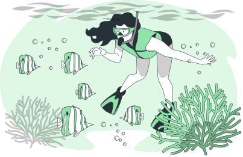

#######################
Adentrándonos en Django
#######################

Ya hemos estudiado los fundamentos de un proyecto Django. Ahora nos adentraremos en herramientas más potentes con las que poder avanzar más rápido en el desarrollo de páginas web dinámicas. [#story-set]_

En este capítulo se tratarán los siguientes contenidos:

.. toctree::
   :maxdepth: 2

   models

.. --------------- Footnotes ---------------

.. [#story-set] Ilustración cortesía de `Storyset`_

.. --------------- Hyperlinks ---------------

.. _Storyset: https://storyset.com/nature
