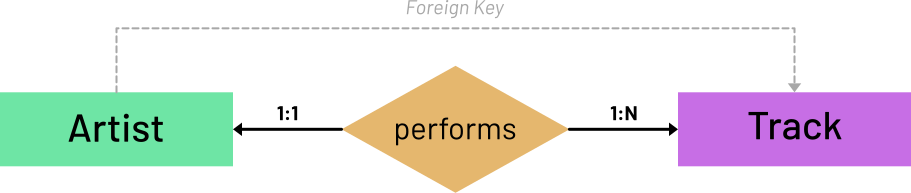

#######
Modelos
#######

Ya hemos visto los :ref:`tipos de campos "básicos" <firststeps/models:tipos de campos>` para un modelo existentes en Django. Ahora profundizaremos un poco más sobre esto descubriendo nuevas posibilidades.

*************
Claves ajenas
*************

Una de las características más potentes que tienen las bases de datos relacionales es su capacidad para crear precisamente relaciones entre entidades (modelos/tablas). Estas relaciones suelen llevarse a cabo a través de las llamadas "Foreign Key" o **claves ajenas**.

Una clave ajena en una base de datos es un atributo que establece una relación entre dos tablas relacionales. Se utiliza para vincular registros de una tabla con registros correspondientes en otra tabla, referenciando la clave principal de esta última. Esto garantiza la integridad referencial y permite acciones como la actualización o eliminación de registros relacionados de manera consistente, manteniendo la coherencia de los datos en la base de datos.

Nuevo modelo
============

Para poder generar una relación necesitamos, al menos, dos modelos. Hasta el momento hemos estado trabajando con un único modelo ``songs.Song`` que disponía de tres campos: ``name``, ``singer`` y ``length``.

Parece que tiene sentido normalizar [#normalizar]_ la base de datos y crear un modelo ``Singer`` que almacene la información propia de cantantes o grupos.

Para ello vamos a :ref:`crear una nueva aplicación <firststeps/apps:creando aplicaciones>` llamada ``singers``:

.. code-block:: console

    $ python manage.py startapp singers

Para "activar" la aplicación no podemos olvidar añadirla a ``settings.py``:

.. code-block::
    :emphasize-lines: 9

    INSTALLED_APPS = [
        'django.contrib.admin',
        'django.contrib.auth',
        'django.contrib.contenttypes',
        'django.contrib.sessions',
        'django.contrib.messages',
        'django.contrib.staticfiles',
        'songs.apps.SongsConfig',
        'singers.apps.SingersConfig',
    ]

Y ahora nos toca crear el modelo ``Singer``. Este modelo, como hemos dicho, se encargará de almacenar los cantantes (o grupos) que tengamos en nuestro proyecto:

.. code-block::
    :caption: :fa:`r:file-lines#green` ``singers/models.py``
    :linenos:

    from django.db import models
    
    
    class Singer(models.Model):
        name = models.CharField(max_length=256)
        starting_year = models.PositiveSmallIntegerField()
        website = models.URLField()

        def __str__(self):
            return self.name
    
Ahora creamos las migraciones correspondientes:

.. code-block:: console

    $ python manage.py makemigrations singers
    Migrations for 'singers':
      singers/migrations/0001_initial.py
        - Create model Singer

Y por último, las aplicamos:

.. code-block:: console

    $ python manage.py migrate
    Operations to perform:
      Apply all migrations: admin, auth, contenttypes, sessions, singers, songs
    Running migrations:
      Applying singers.0001_initial... OK

Vinculando modelos
==================

El objetivo ahora es vincular el modelo ``Song`` con el modelo ``Singer``. En un diagrama entidad-relación tendríamos lo siguiente:

    Entidad-Relación

Este diagrama nos dice lo siguiente:

1. Un cantante interpreta una o muchas canciones.
2. Una canción es interpretada por uno y solo un cantante. [#n-n]_

Por tanto se "transfiere" una clave ajena ("Foreign Key") que estará presente en el modelo ``Song`` y que hará referencia al modelo ``Singer``.

Creando claves ajenas
=====================

Ya estamos en disposición de añadir la clave ajena al modelo ``songs.Song`` modificando el antiguo campo ``singer`` de tipo ``CharField`` y convirtiéndolo en un campo de tipo `ForeignKey`_:

.. code-block::
    :caption: :fa:`r:file-lines#green` ``songs/models.py``
    :linenos:
    :emphasize-lines: 6-10

    from django.db import models
    
    
    class Song(models.Model):
        name = models.CharField(max_length=256)
        singer = models.ForeignKey(
            'singers.Singer',
            on_delete=models.CASCADE,
            related_name='songs',
        )
        length = models.IntegerField()  # in seconds
    
        def __str__(self):
            return self.name

Analicemos las líneas más importantes:

- **L6** → Ahora el campo ``singer`` se convierte en una clave ajena usando el campo ``models.ForeignKey``.
- **L7** → El primer parámetro siempre será el modelo al que hace referencia la clave ajena. Es muy habitual usar una cadena de texto con notación ``'<app>.<Model>'``.
- **L8** → El segundo parámetro requerido es ``on_delete`` en el que debemos especificar el comportamiento a seguir cuando se borra un objeto de referencia. En este caso hemos indicado borrado en cascada.
- **L9** → El parámetro ``related_name`` es muy interesante ya que nos permite dar un nombre a la relación "inversa" entre el objeto de referencia y el objeto relacionado.

    
.. _ForeignKey: https://docs.djangoproject.com/en/dev/ref/models/fields/#django.db.models.ForeignKey

.. [#normalizar] "Normalizar" una base de datos se refiere al proceso de organizar la estructura de la base de datos para reducir la redundancia de datos y mejorar la integridad y eficiencia.
.. [#n-n] Sería muy razonable que la relación entre cantante y canción fuera de N:N indicando que una canción puede ser cantada por múltiples cantantes. En este momento nos quedaremos en un esquema más simple 1:N.
