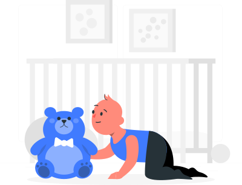

#########################
Primeros pasos con Django
#########################

Django es un framework de desarrollo web en Python que te ayuda a construir aplicaciones web de forma rápida y estructurada. Con Django, puedes crear páginas web dinámicas y potentes utilizando Python y sus numerosas características integradas. [#story-set]_

En este capítulo se tratarán los siguientes contenidos:

.. toctree::
   :maxdepth: 2

   setup
   apps
   models
   urls
   views
   templates

.. --------------- Footnotes ---------------

.. [#story-set] Ilustración cortesía de `Storyset`_

.. --------------- Hyperlinks ---------------

.. _Storyset: https://storyset.com/online
