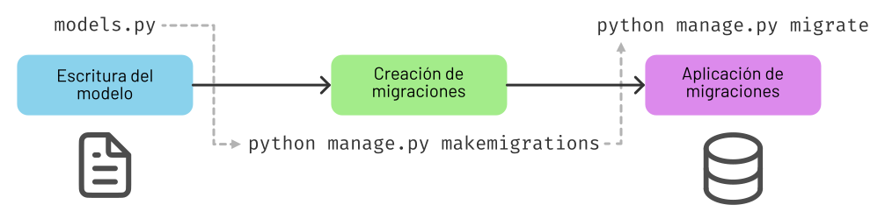

#######
Modelos
#######

Como hemos visto en las :ref:`características de Django <webdev/django:características>` hay un **ORM** que vincula tablas de la base de datos con objetos de Python.

Un modelo es simplemente una clase de Python que hereda características definidas (en otras clases) del propio framework de Django.

***************
Creando modelos
***************

Vamos a empezar por nuestro primer modelo que va a representar una canción:

.. code-block::
    :caption: :fa:`r:file-lines#green` ``songs/models.py``
    :linenos:

    from django.db import models
    
    
    class Song(models.Model):
        name = models.CharField(max_length=256)
        singer = models.CharField(max_length=256)
        length = models.IntegerField()  # in seconds

Analizamos cada línea por separado:

- **L1** → Importamos el módulo Django para gestión de modelos.
- **L4** → Las clases que representan modelos deben heredar de: `models.Model`_
- **L5** → Los campos de la "tabla" son *atributos de clase* (objetos de alguna clase predefinida en Django). [#field-reference]_
- **L6** → El parámetro ``max_length`` indica el tamaño máximo de cadena de texto que se puede almacenar en la base de datos. [#max-length]_
- **L7** → Campo de tipo numérico entero.

Tipos de campos
===============

En Django disponemos de una gran variedad de `tipos de campos <https://docs.djangoproject.com/en/dev/ref/models/fields/#field-types>`_ para modelos. A continuación se muestra una tabla resumen con los más destacados:

.. csv-table:: Principales tipos de campos de modelo en Django
    :file: tables/field-types.csv
    :header-rows: 1
    :widths: 20, 60, 20

***********
Migraciones
***********

Una vez que tenemos escrito nuestro modelo (como fichero Python) debemos crear la tabla correspondiente a nivel de la base de datos. Para ello hacemos uso de las migraciones.

Flujo de trabajo
================

El flujo de trabajo con las migraciones consta de 3 pasos:

1. Escribir nuestro modelo en ``models.py``
2. Crear las migraciones.
3. Aplicar las migraciones.

    Flujo de trabajo con migraciones

Creando migraciones
===================

El primer paso es **crear las migraciones**. Aplicamos el siguiente comando:

.. code-block:: console

    $ python manage.py makemigrations
    Migrations for 'songs':
      songs/migrations/0001_initial.py
        - Create model Song

.. hint::
    Si usamos ``python manage.py makemigrations songs`` estaríamos creando las migraciones **únicamente** de la aplicación ``songs``.

Lo que acaba de ocurrir es que se ha creado un fichero Python dentro de la carpeta ``migrations`` de la aplicación ``songs``. Este fichero tiene el siguiente aspecto:

.. code-block::
    :caption: :fa:`r:file-lines#green` ``songs/migrations/0001_initial.py``
    :linenos:

    # Generated by Django 5.0.2 on 2024-03-03 17:47
    
    from django.db import migrations, models
    
    
    class Migration(migrations.Migration):
    
        initial = True
    
        dependencies = [
        ]
    
        operations = [
            migrations.CreateModel(
                name='Song',
                fields=[
                    ('id', models.BigAutoField(auto_created=True, primary_key=True, serialize=False, verbose_name='ID')),
                    ('name', models.CharField(max_length=256)),
                    ('singer', models.CharField(max_length=256)),
                    ('length', models.IntegerField()),
                ],
            ),
        ]

Podemos intuir el funcionamiento. Hay una serie de operaciones (como lista) en la que se van registrando las acciones a realizar en la migración. En este caso la única operación es crear el modelo con los campos indicados.

Aplicando migraciones
=====================

Ya estamos en disposición de aplicar las migraciones generadas. Para ello usamos el siguiente comando:

.. code-block:: console

    $ python manage.py migrate
    Operations to perform:
      Apply all migrations: admin, auth, contenttypes, sessions, songs
    Running migrations:
      Applying songs.0001_initial... OK
    
En la salida podemos observar que se están **aplicando todas las migraciones**. Las aplicaciones que nos aparecen (``admin``, ``auth``, ``contenttypes``, ``sessions``) además de ``songs`` están ahí porque vienen :ref:`preinstaladas <firststeps/apps:instalando aplicaciones>` al crear un proyecto Django.

.. hint::
    Si usamos ``python manage.py migrate songs`` estaríamos aplicando las migraciones **únicamente** de la aplicación ``songs``.

*************
Base de datos
*************

La configuración de la base de datos del proyecto se encuentra en la variable ``DATABASES`` del fichero ``settings.py`` y tiene este aspecto::

    DATABASES = {
        'default': {
            'ENGINE': 'django.db.backends.sqlite3',
            'NAME': BASE_DIR / 'db.sqlite3',
        }
    }

Podemos ver que se trata de un diccionario con una clave ``default`` lo que nos hace pensar que podemos definir configuraciones alternativas para la base de datos.

En esta configuración "por defecto" tenemos un motor de base de datos `sqlite`_ y almacenará la información en un fichero ``db.sqlite3`` dentro de la carpeta base (raíz) del proyecto.

.. warning::
    El fichero de base de datos debe estar fuera del control de versiones.

Tablas de la base de datos
==========================

Una vez aplicada :ref:`la migración <firststeps/models:creando migraciones>` de nuestro modelo ``Song`` podemos comprobar que se ha creado la tabla correspondiente en la base de datos. Para acceder a la base de datos lanzamos el siguiente comando:

.. code-block:: console

    $ python manage.py dbshell
    SQLite version 3.43.2 2023-10-10 13:08:14
    Enter ".help" for usage hints.
    sqlite>

Una vez dentro del cliente de la base de datos, consultamos las tablas creadas:

.. code-block:: sqlite3

    sqlite> .tables
    auth_group                  django_admin_log
    auth_group_permissions      django_content_type
    auth_permission             django_migrations
    auth_user                   django_session
    auth_user_groups            songs_song
    auth_user_user_permissions

Más allá de ``auth_*`` y ``django_*`` que vienen de las aplicaciones preinstaladas de Django, podemos observar que se ha creado la tabla ``songs_song``.

.. note::
    La nomenclatura que usa Django en la base de datos para crear las tablas es: ``<nombre-de-aplicación>_<nombre-de-modelo>``.

Si consultamos el esquema de la tabla ``songs_song`` podemos comprobar que los atributos son los definidos en el :ref:`modelo <firststeps/models:creando modelos>`:

.. code-block:: sqlite3
    :emphasize-lines: 4-6

    sqlite> .schema songs_song
    CREATE TABLE IF NOT EXISTS "songs_song" (
        "id" integer NOT NULL PRIMARY KEY AUTOINCREMENT,
        "name" varchar(256) NOT NULL,
        "singer" varchar(256) NOT NULL,
        "length" integer NOT NULL
    );

Identificador de tabla
======================

Vamos a analizar con un poco más detalle el esquema de la tabla ``songs_song``:

.. code-block:: sql
    :emphasize-lines: 2

    CREATE TABLE IF NOT EXISTS "songs_song" (
        "id" integer NOT NULL PRIMARY KEY AUTOINCREMENT,
        "name" varchar(256) NOT NULL,
        "singer" varchar(256) NOT NULL,
        "length" integer NOT NULL
    );

Aquí nos damos cuenta de un detalle: Aparece un campo "id" que no se especificó en el modelo. Esto se debe a que Django incluye (por defecto) un campo "id" de tipo *entero y autoincremental* como **clave primaria** para todos los modelos creados en el proyecto. [#clave-primaria]_

***********************
Interfaz administrativa
***********************

Ya hemos visto anteriormente :ref:`cómo acceder a la interfaz administrativa <firststeps/setup:interfaz administrativa>` de Django. En este apartado veremos cómo "activar" los modelos personalizados para que los podamos gestionar desde la interfaz administrativa.

Lo primero que debemos hacer es editar el fichero ``admin.py`` que se encuentra junto al de ``models.py`` y que, como su nombre indica, permite establecer los aspectos relacionados con la interfaz administrativa:

.. code-block::
    :caption: :fa:`r:file-lines#green` ``songs/admin.py``
    :linenos:

    from django.contrib import admin
    
    from .models import Song
    
    
    @admin.register(Song)
    class SongAdmin(admin.ModelAdmin):
        pass

Analizamos cada línea por separado:

- **L1** → Importamos el módulo Django para gestión de la interfaz administrativa.
- **L3** → Importamos el modelo que queramos registrar (activar).
- **L6** → Usamos el decorador ``admin.register`` que permite registrar el modelo en cuestión.
- **L7** → Necesitamos crear una clase que hereda de ``admin.ModelAdmin`` para que su funcionamiento sea el correcto.
- **L8** → De momento no vamos a incluir ninguna otra personalización.

.. tip::
    Es una convención que si un modelo se llama ``Matraca`` entonces la clase administrativa se debería llamar ``MatracaAdmin``.
    
Si ahora accedemos a la interfaz administrativa en http://localhost:8000/admin/ podemos observar que se ha añadido un bloque para gestionar el modelo ``Song`` de la aplicación ``songs``:

    Modelo disponible para gestión en interfaz administrativa

La interfaz administrativa se puede `configurar en profundidad <https://docs.djangoproject.com/en/dev/ref/contrib/admin/>`_, pero así de primeras vemos que tenemos capacidad de añadir nuevos objetos (filas en la tabla) de manera muy rápida y cómoda:

    Añadir nuevo objeto de tipo ``Song``

***
ORM
***

Un ORM [#orm]_ es una pieza de software que relaciona (mapea) entidades de la base de datos con objetos del lenguaje de programación.

    Funcionamiento de un ORM

En el caso concreto de Django, obviamente el lenguaje de programación es Python y los objetos se convierten en instancias de una clase vinculada con la respectiva tabla de la base de datos.

Una forma "agradable" de empezar a familiarizarse con el ORM de Django es utilizar la **consola interactiva de Django**:

.. code-block:: console

    $ python manage.py shell
    Python 3.12.1 (main, Feb  1 2024, 17:06:32) [Clang 15.0.0 (clang-1500.1.0.2.5)]
    Type 'copyright', 'credits' or 'license' for more information
    IPython 8.22.2 -- An enhanced Interactive Python. Type '?' for help.
    
    >>>

.. tip::
    Si quieres tener una mejor experiencia en la consola interactiva de Django puedes instalar ``pip install ipython``.

Una vez entramos, queda a la espera de introducir una instrucción. Es como una consola de Python pero que ya tiene cargada la configuración (``settings.py``) de nuestro proyecto.

Creando registros
=================

Dado que nuestra tabla de canciones está vacía, podríamos empezar por crear alguna canción:

.. code-block::
    :linenos:

    >>> from songs.models import Song

    >>> s = Song(name='Wonderwall', singer='Oasis', length=258)
    >>> s.save()

Analizamos cada línea por separado:

- **L1** → Para poder trabajar con un modelo necesitamos importarlo de la aplicación correspondiente.
- **L3** → Esto no deja de ser una llamada al constructor. Utilizamos parámetros nominales porque no estamos fijando el campo "id" que ocuparía la primera posición en los parámetros.
- **L4** → El método ``save()`` se encarga de escribir esta "fila" en la tabla ``songs_song`` de la base de datos.

Ahora podemos comprobar que los datos se han guardado correctamente en la base de datos:

.. code-block:: console
    :emphasize-lines: 5

    $ python manage.py dbshell
    SQLite version 3.43.2 2023-10-10 13:08:14
    Enter ".help" for usage hints.
    sqlite> select * from songs_song;
    1|Wonderwall|Oasis|258
    sqlite>

Efectivamente los datos están en la tabla y el campo "id" (primera columna) se ha asignado automáticamente.

Usando create
-------------

Una alternativa bastante cómoda a la hora de crear nuevos objetos en la base de datos es usar un "atajo" a través de la función ``create()``. Veamos cómo aplicarla:

.. code-block::

    >>> from songs.models import Song

    >>> Song.objects.create(name='Bohemian Rhapsody', singer='Queen', length=354)

En una línea ya hemos creado y guardado el objeto en la base de datos. Más adelante se verá el significado del atributo ``objects``.

Consultando registros
=====================

Veamos ahora cómo podemos consultar registros a través del ORM.

Managers
--------

Lo primero que hay que manejar es el concepto de `manager`_. Un "manager" en Django es una interfaz que proporciona operaciones de consulta a objetos de modelo::

    >>> from songs.models import Song

    >>> type(Song.objects)
    <class 'django.db.models.manager.Manager'>

El manager por defecto que proporciona Django es ``objects`` y se encuentra disponible en todos los objetos de modelo que creemos. Este manager engloba todas las "filas" de la tabla a la que está vinculado el modelo.

Consultas
---------

La primera consulta que nos puede venir a la cabeza es obtener todos los registros de la tabla. En el caso que nos ocupa veamos cómo extraer **todas las canciones** que han sido almacenadas:

.. code-block::
    :linenos:

    >>> from songs.models import Song

    >>> Song.objects.all()
    <QuerySet [<Song: Song object (1)>, <Song: Song object (2)>]>

Esta línea nos ha retornado un `QuerySet`_ con dos resultados (aparentemente las dos canciones que hemos guardado hasta el momento en la base de datos). Un *QuerySet*, como su nombre indica, representa el resultado de una consulta y contiene una "lista" de objetos de modelo.

Lo extraño aquí es que nos aparecen los objetos representados por ``<Song: Song object (1)>``. Esto se debe a que no hemos implementado aún el método ``__str__()``. Vamos a añadirlo:

.. code-block::
    :emphasize-lines: 6-7

    class Song(models.Model):
        name = models.CharField(max_length=256)
        singer = models.CharField(max_length=256)
        length = models.IntegerField()  # in seconds
    
        def __str__(self):
            return self.name

Si ahora volvemos a hacer la consulta obtenemos los resultados esperados::

    >>> from songs.models import Song

    >>> Song.objects.all()
    <QuerySet [<Song: Wonderwall>, <Song: Bohemian Rhapsody>]>

.. attention::
    Dado que hemos cambiado el modelo, debemos salir y volver a entrar en la consola interactiva para que los cambios surtan efecto.

Recorriendo consultas
^^^^^^^^^^^^^^^^^^^^^

Dado que un *QuerySet* es un objeto **iterable**, podemos recorrer fácilmente cada resultado de la consulta a través de un bucle::

    >>> for song in Song.objects.all():
    ...     msg = f'"{song.name}" performed by "{song.singer}"'
    ...     print(msg)
    ...
    "Wonderwall" performed by "Oasis"
    "Bohemian Rhapsody" performed by "Queen"

.. note::
    Dado que ``song`` es un objeto de tipo ``Song`` podemos acceder a sus atributos normalmente que están vinculados con campos de la base de datos.

Filtrando resultados
^^^^^^^^^^^^^^^^^^^^

También es posible filtrar los resultados. Supongamos que queremos quedarnos con las canciones cuya duración es superior a 5 minutos:

    >>> Song.objects.filter(length__gt=300)  # 5*60
    <QuerySet [<Song: Bohemian Rhapsody>]>

Aquí estamos usando el método `filter()`_ que tiene una sintaxis algo especial. La condición se convierte en un parámetro con el nombre del campo seguido de doble barra baja y el operador en formato texto (``gt`` viene de "greater than").

Aunque sólo tengamos un resultado, seguimos obteniendo un *QuerySet* con un único objeto.

Recuperando un objeto
^^^^^^^^^^^^^^^^^^^^^

Si queremos encontrar un objeto en concreto podemos utilizar el método ``get()``. Por ejemplo, supongamos que queremos extraer la canción "Wonderwall"::

    >>> song = Song.objects.get(name='Wonderwall')

    >>> type(song)
    <class 'songs.models.Song'>

Si nos fijamos aquí lo que obtenemos es un objeto de tipo ``Song`` (ya no tenemos un *QuerySet*). Por tanto, con este objeto podemos acceder normalmente a sus atributos (campos mapeados desde la base de datos)::

    >>> song.id
    1
    >>> song.name
    'Wonderwall'
    >>> song.singer
    'Oasis'
    >>> song.length
    258

Hay que tener en cuenta que si lo que buscamos con un ``get()`` no existe, se lanzará una excepción::

    >>> Song.objects.get(name='Wonderwalk')
    Traceback (most recent call last):
      Cell In, line 1
        Song.objects.get(name='Wonderwalk')
    DoesNotExist: Song matching query does not exist.

.. [#field-reference] Véase la `referencia de campos de modelo`_ en la documentación de Django.
.. [#max-length] ``max_length`` es un parámetro requerido para campos de tipo ``CharField`` salvo cuando se usa PostgreSQL como base de datos.
.. [#clave-primaria] Es posible crear una clave primaria personalizada y no hacer uso del campo "id" predefinido por Django.
.. [#orm] Object Relational Mapping

.. _referencia de campos de modelo: https://docs.djangoproject.com/en/dev/ref/models/fields/
.. _models.Model: https://docs.djangoproject.com/en/dev/ref/models/class/
.. _sqlite: https://www.sqlite.org/
.. _manager: https://docs.djangoproject.com/en/dev/topics/db/managers/
.. _QuerySet: https://docs.djangoproject.com/en/dev/ref/models/querysets/
.. _filter(): https://docs.djangoproject.com/en/dev/ref/models/querysets/#filter
