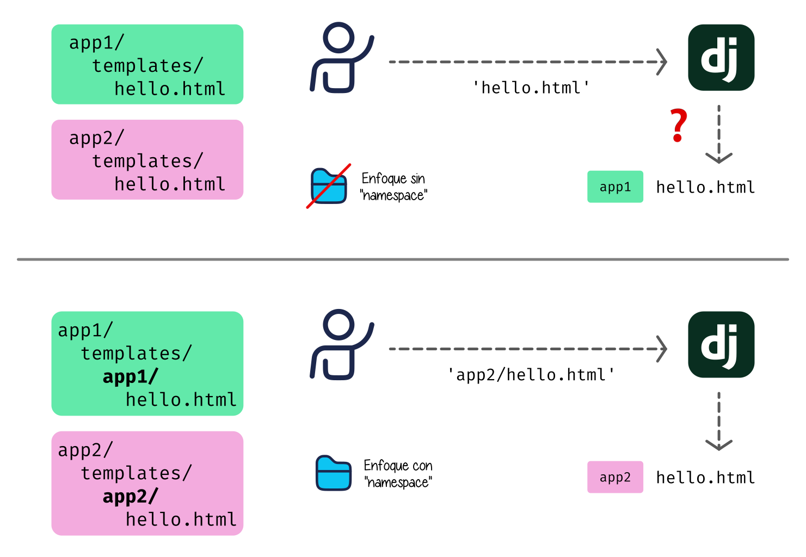
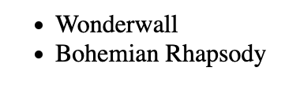
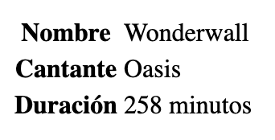
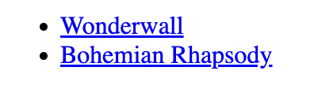
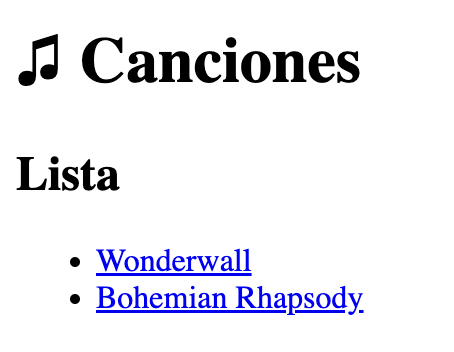
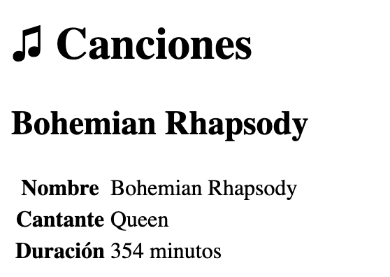

##########
Plantillas
##########

Las plantillas nos permiten diseñar el aspecto visual de nuestro proyecto. Podemos incorporar información dinámica, lo que las hace muy versátiles.

Una plantilla en Django está habitualmente escrita en lenguaje "html" e incorpora fragmentos de código específicos del `lenguaje de plantillas de Django`_.

**************************
Dónde viven las plantillas
**************************

Una plantilla es un archivo, habitualmente con extensión ``.html`` y que reside en alguna carpeta de nuestro proyecto.

Las plantillas vinculadas con una aplicación ``app`` deberían [#template-loaders]_ residir en la subcarpeta ``templates/app/`` de dicha aplicación. Ejemplo:

+-----------+----------------------------+
|    App    |     Ruta de plantillas     |
+===========+============================+
| ``songs`` | ``songs/templates/songs/`` |
+-----------+----------------------------+

Esto, a priori, puede parecer repetitivo. Pero la razón de hacerlo así se debe a que Django busca las plantillas en todas las carpetas ``templates`` de las aplicaciones dadas de alta en el proyecto.

Por lo tanto, siguiendo este esquema podemos crear un cierto "namespace" o espacio de nombres para las plantillas de cada aplicación.

    Carga de plantillas en Django

******************
Creando plantillas
******************

A continuación vamos a empezar a crear plantillas para poder mostrar información de nuestra aplicación.

Plantilla de lista
==================

Supongamos una primera plantilla que se encarga de mostrar todas las canciones almacenadas en la base de datos de ``musicalia``.

.. code-block:: htmldjango
    :caption: :fa:`r:file-lines#green` ``songs/templates/songs/song/list.html``
    :linenos:

    <ul>
      
        <li>{{ song }}</li>
      
    </ul>
    
Analicemos cada línea por separado:

- **L1** → Usaremos una etiqueta *html* ``<ul>`` para construir una lista.
- **L2** → Usamos un **bucle** para recorrer las canciones. Esta construcción en Django recibe el nombre de **template tag** (etiqueta de plantilla).
- **L3** → Usamos una etiqueta ``<li>`` y añadimos la canción en concreto que nos viene del bucle.
- **L4** → Cerramos la etiqueta de plantilla del bucle.
- **L5** → Cerramos la etiqueta *html* de lista.

Conceptos que se deben manejar:

Contexto:
  Es el conjunto de variables al que una plantilla tiene acceso. En el ejemplo anterior la variable ``songs`` está en el contexto ya que se ha pasado de forma explícita desde la vista.

Etiqueta de plantilla:
  Las etiquetas de plantilla se escriben usando los delimitadores ````. Existe una amplia variedad de `etiquetas de plantilla predefinidas`_ en Django. [#template-tag]_

Acceso a variable:
  Para acceder a una variable en una plantilla usamos los delimitadores ``{{ }}``.

Si ahora accedemos a http://localhost:8000/song/ veremos la lista de canciones disponibles:

    Plantilla de lista de canciones
  
Plantilla de detalle
====================

Es muy habitual implementar una plantilla para ver los detalles de un objeto en concreto. En nuestro ejemplo vamos a implementar una plantilla para mostrar la información de una canción (objeto de tipo ``Song``).

.. code-block:: htmldjango
    :caption: :fa:`r:file-lines#green` ``songs/templates/songs/song/detail.html``
    :linenos:

    <table>
      <tr>
        <th>Nombre</th>
        <td>{{ song.name }}</td>
      </tr>
      <tr>
        <th>Cantante</th>
        <td>{{ song.singer }}</td>
      </tr>
      <tr>
        <th>Duración</th>
        <td>{{ song.length }} minutos</td>
      </tr>
    </table>

Se puede ver que en las líneas L4, L8 y L12 estamos accediendo a los atributos de modelo del objeto ``song`` que se ha pasado al contexto de la plantilla desde la vista correspondiente.

Si ahora accedemos a http://localhost:8000/song/1/ veremos el detalle de la canción con ``pk=1``:

    Plantilla de detalle de canción

********************
Enlazando plantillas
********************

Sería muy útil poder enlazar cada una de las canciones en el listado inicial con su correspondiente detalle. Para ello vamos a modificar la :ref:`plantilla de lista <firststeps/templates:plantilla de lista>` añadiendo el vínculo correspondiente.

Una primera aproximación sería la siguiente:

.. code-block:: htmldjango
  :caption: :fa:`r:file-lines#green` ``songs/templates/songs/song/list.html``
  :linenos:
  :emphasize-lines: 3

  <ul>
    
      <li><a href="/songs/{{song.pk}}/">{{ song }}</a></li>  <!-- NOT THIS WAY! -->
    
  </ul>

En la L3 hemos añadido una etiqueta ``<a>`` apuntando a la url de detalle de cada canción. Pero esto se considera una **mala práctica** ya que, en el caso de que la url se modifique en el fichero ``urls.py`` tendríamos que rastrear todo nuestro código en busca de esa url y modificarla.

Es por ello que **se recomienda** usar la etiqueta de plantilla `url`_ que permite "inyectar" una url en una plantilla a partir del **nombre de la url** definido en el fichero ``urls.py``. Veamos cómo quedaría nuestro ejemplo:

.. code-block:: htmldjango
  :caption: :fa:`r:file-lines#green` ``songs/templates/songs/song/list.html``
  :linenos:
  :emphasize-lines: 3

  <ul>
    
      <li><a href="">{{ song }}</a></li>
    
  </ul>
  
La etiqueta de plantilla ```` recibe:

- El nombre de la url cualificado con su espacio de nombres. En este caso el espacio de nombres es ``songs`` ya que se ha definido así en el atributo ``app_name`` del fichero ``songs/urls.py``.
- Los argumentos necesarios. En este caso pasamos el identificador de la canción.

Por tanto, al acceder ahora a http://localhost:8000/songs/ veríamos los enlaces correctamente:
  

    Plantilla de lista de canciones con enlaces

**********************
Herencia de plantillas
**********************

Supongamos que queremos poner algún tipo de cabecera a las plantillas indicando el nombre del proyecto "Musicalia". Si no tuviéramos otra herramienta, tendríamos que incluir esa cabecera en todas las plantillas que hayamos escrito.

Sin embargo, Django proporciona una característica muy útil denominada `herencia de plantillas`_ que nos permite heredar desde una plantilla base.

Plantilla base
==============

En una primera aproximación vamos a crear la siguiente **plantilla base**:

.. code-block:: htmldjango
  :caption: :fa:`r:file-lines#green` ``songs/templates/songs/base.html``
  :linenos:

  <html>
  <head>
    <title>Musicalia</title>
  </head>
  <body>
    <h1>♫ Canciones</h1>
    <h2></h2>
    
  </body>
  </html>
  
Analicemos las líneas más importantes:

- **L6** → Este encabezado será común a toda la aplicación ``songs``.
- **L7** → Se define un bloque "vacío" ``subtitle`` con la idea de que sea completado en plantillas derivadas.
- **L8** → Se define un bloque "vacío" ``contents`` con la idea de que sea completado en plantillas derivadas.

Extendiendo plantillas
======================

Ahora podemos modificar las plantillas previas para extender (heredar) desde esta plantilla base. Veamos los cambios aplicados.

Empezamos con las modificaciones hechas a la :ref:`plantilla de lista <firststeps/templates:plantilla de lista>`:

.. code-block:: htmldjango
  :caption: :fa:`r:file-lines#green` ``songs/templates/songs/song/list.html``
  :linenos:
  :emphasize-lines: 1, 3, 5, 11

  
  
  Lista
  
  
  <ul>
    
      <li><a href="">{{ song }}</a></li>
    
  </ul>
  
  
Analicemos las líneas más importantes:

- **L1** → Estamos usando la etiqueta de plantilla `extends`_ para indicar que heredamos (o extendemos) la plantilla ``songs/base.html``. [#template-tag]_
- **L3** → Estamos sobreescribiendo o "rellenando" el bloque ``subtitle`` con el contenido propio de esta plantilla.
- **L5** → Estamos sobreescribiendo o "rellenando" el bloque ``contents`` con el contenido propio de esta plantilla.

.. tip::
  El contenido del bloque se puede rellenar en la misma línea o en varias líneas. Es más una cuestión estética de organización del código.

Podemos ver los cambios aplicados accediendo a http://localhost:8000/songs/:

    Plantilla de lista de canciones con herencia

Del mismo modo, vamos a modificar la :ref:`plantilla de detalle <firststeps/templates:plantilla de detalle>` para heredar desde la :ref:`plantilla base <firststeps/templates:plantilla base>`:

.. code-block::
  :caption: :fa:`r:file-lines#green` ``songs/templates/songs/song/detail.html``
  :linenos:
  :emphasize-lines: 1, 3, 5, 20

  
  
  {{ song.name }}
  
  
  <table>
    <tr>
      <th>Nombre</th>
      <td>{{ song.name }}</td>
    </tr>
    <tr>
      <th>Cantante</th>
      <td>{{ song.singer }}</td>
    </tr>
    <tr>
      <th>Duración</th>
      <td>{{ song.length }} minutos</td>
    </tr>
  </table>
  

Analicemos las líneas más importantes:

- **L1** → Estamos usando la etiqueta de plantilla `extends`_ para indicar que heredamos (o extendemos) la plantilla ``songs/base.html``. [#template-tag]_
- **L3** → Estamos sobreescribiendo o "rellenando" el bloque ``subtitle`` con el contenido propio de esta plantilla. Nótese que podemos usar objetos del contexto dentro del bloque.
- **L5** → Estamos sobreescribiendo o "rellenando" el bloque ``contents`` con el contenido propio de esta plantilla.

Podemos ver los cambios aplicados accediendo a http://localhost:8000/songs/2/:

    Plantilla de detalle de canción con herencia

.. _lenguaje de plantillas de Django: https://docs.djangoproject.com/en/dev/ref/templates/language/
.. _etiquetas de plantilla predefinidas: https://docs.djangoproject.com/en/dev/ref/templates/builtins/#built-in-tag-reference
.. _url: https://docs.djangoproject.com/en/dev/ref/templates/builtins/#url
.. _herencia de plantillas: https://docs.djangoproject.com/en/dev/ref/templates/language/#template-inheritance
.. _extends: https://docs.djangoproject.com/en/dev/ref/templates/builtins/#std-templatetag-extends

.. [#template-loaders] Se considera una buena práctica que las plantillas vinculadas con una aplicación residan en dicha aplicación, pero hay `otras formas <https://docs.djangoproject.com/en/dev/topics/templates/#loaders>`_ de configurar los cargadores de plantillas en Django.
.. [#template-tag] No todas las etiquetas de plantilla necesitan una etiqueta de cierre.
