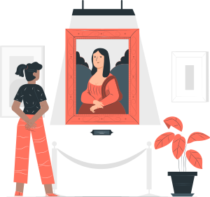

########
Planta 1 
########

Entramos al **MDWD** (Museo del Desarrollo Web con Django). Se trata de un edificio con varias pisos que nos sumerge en un viaje a través de las herramientas necesarias para poder programar aplicaciones web dinámicas con el framework Django y con el lenguaje de programación Python. [#story-set]_

|spacer1|

*****************
Salas disponibles
*****************

En esta planta podemos encontrar las siguientes salas:

.. toctree::
   :maxdepth: 2

   webdev
   technologies
   django

.. --------------- Footnotes ---------------

.. [#story-set] Ilustración cortesía de `Storyset`_

.. --------------- Hyperlinks ---------------

.. _Storyset: https://storyset.com/culture 
