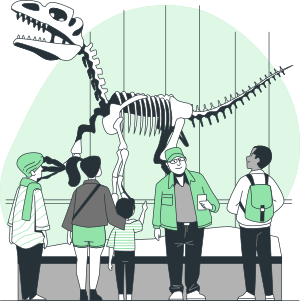

########
Planta 2
########

Seguimos en el **MDWD** (Museo del Desarrollo Web con Django). Llamamos al ascensor porque vamos a subir a la segunda planta y continuar visitando salas para descubrir nuevas herramientas de Django. [#story-set]_

|spacer1|

*****************
Salas disponibles
*****************

En esta planta podemos encontrar las siguientes salas:

.. toctree::
   :maxdepth: 2

   setup

.. --------------- Footnotes ---------------

.. [#story-set] Ilustración cortesía de `Storyset`_

.. --------------- Hyperlinks ---------------

.. _Storyset: https://storyset.com/culture 
