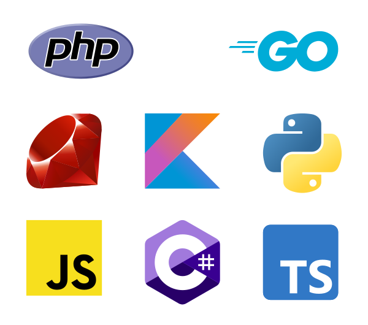
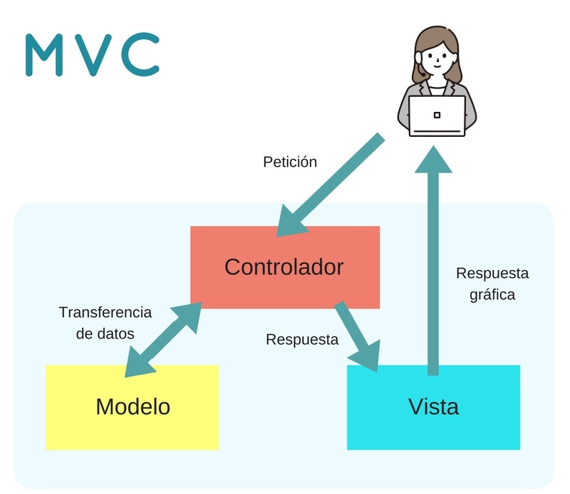
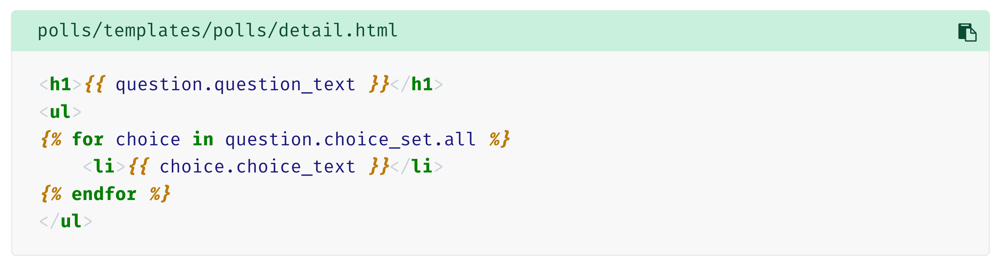
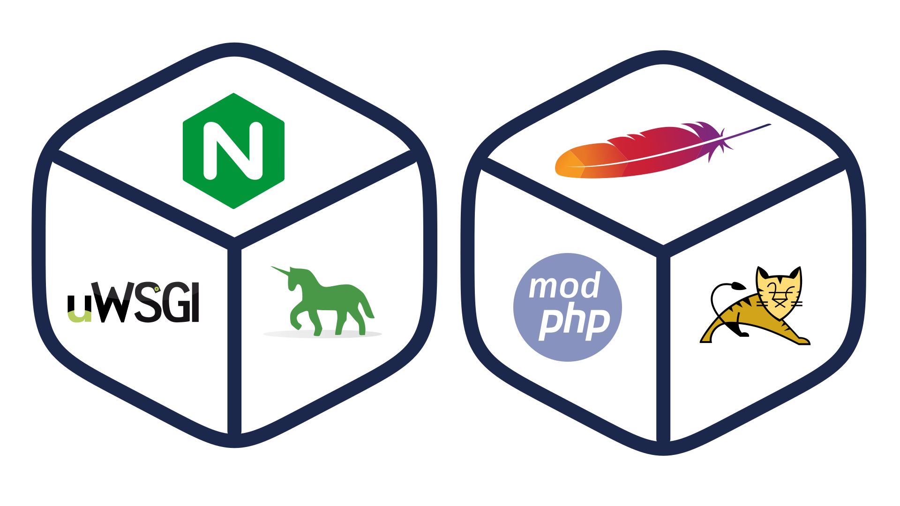

###############
Tecnologías web
###############

Cuando se programa una **aplicación** se hace utilizando un **lenguaje de programación**. Por ejemplo, utilizas el lenguaje Python para crear aplicaciones que se ejecuten en distintos sistemas operativos. Al programar cada aplicación utilizas ciertas herramientas como un entorno de desarrollo o librerías de código. Además, una vez acabado su desarrollo, esa aplicación necesitará ciertos componentes para su ejecución, como por ejemplo un intérprete dentro de un entorno virtual.

En este bloque veremos **distintas tecnologías** que se pueden utilizar para **programar aplicaciones** que se ejecuten en un **servidor web**, y cómo se relacionan unas con otras. Analizaremos las ventajas e inconvenientes de utilizar cada una, y qué lenguajes de programación se deben aprender para utilizarlas.

Los **componentes principales** con los que se debe contar para ejecutar aplicaciones web en un servidor son los siguientes:

1. Un **servidor web** para recibir las peticiones de los clientes web (normalmente navegadores) y enviarles la página que solicitan (una vez generada puesto que hablamos de páginas web dinámicas). El servidor web debe conocer el procedimiento a seguir para generar la página web: qué módulo se encargará de la ejecución del código y cómo se debe comunicar con él.

2. El **módulo encargado de ejecutar el código** o programa y generar la página web resultante. Este módulo debe integrarse de alguna forma con el servidor web, y dependerá del lenguaje y tecnología que utilicemos para programar la aplicación web.

3. Un **sistema gestor de base de datos**. Este módulo no es estrictamente necesario pero en la práctica se utiliza en todas las aplicaciones web que manejan ciertas cantidades de datos o información.

4. El **lenguaje de programación** que utilizarás para desarrollar las aplicaciones.

Además de los componentes a utilizar, también es importante decidir cómo vas a **organizar el código** de la aplicación. Muchas de las arquitecturas que se usan en la programación de aplicaciones web te ayudan a estructurar el código de las aplicaciones en **capas o niveles**.

El motivo de dividir en capas el diseño de una aplicación es que se puedan **separar las funciones lógicas** de la misma, favoreciendo la reutilización y el desacoplamiento de los componentes.

En una aplicación se puede distinguir, de forma general, funciones de **presentación** (se encarga de dar formato a los datos para presentárselo al usuario final), **lógica de negocio** (utiliza los datos para ejecutar un proceso y obtener un resultado) y **persistencia** (que mantiene los datos almacenados de forma organizada).

.. figure:: images/webtech/webdev-layers.png
    :align: center

    Capas en arquitectura web

*******************************
Elección de la arquitectura web
*******************************

La primera elección antes de comenzar a programar una aplicación web es **elegir la arquitectura** a utilizar.

Podríamos diferenciar tres tipos de aspectos en relación con la arquitectura de una aplicación web:

1. Aspectos software.
2. Aspectos hardware.
3. Aspectos empresariales.

Aspectos software
=================

1. ¿Qué lenguaje de programación se utilizará?
2. ¿Necesito un framework web? ¿Cuál se adapta mejor al proyecto?
3. ¿Qué modelo de ejecución es el más adecuado? ¿SSR o CSR?
4. ¿Necesito persistencia? ¿Qué base de datos se utilizará?
5. ¿Base de datos relacional vs clave-valor? ¿Puedo usar ambas?
6. ¿Sobre qué servidor web se va a desplegar la aplicación?
7. ¿Qué servidor de aplicación se requiere?
8. ¿Qué tipo de licencia voy a establecer para la aplicación que desarrolle?

Aspectos hardware
=================

1. ¿Qué tipo de infraestructura hay disponible?
2. ¿Necesito infraestructura "on-premise" o "cloud"?
3. ¿Qué coste/beneficio me proporciona cada solución?
4. ¿Qué requerimientos debe tener la(s) máquina(s) del proyecto?
5. ¿Cómo se gestiona la escalabilidad de la aplicación?

Aspectos empresariales
======================

1. ¿Qué tamaño tiene el proyecto?
2. ¿Qué lenguajes de programación conozco? ¿Vale la pena el esfuerzo de aprender uno nuevo?
3. ¿Voy a usar herramientas de código abierto o herramientas propietarias? ¿Cuál es el coste de utilizar soluciones comerciales?
4. ¿Voy a programar la aplicación yo solo o formaré parte de un equipo de desarrollo?

Estudiando las respuestas a estas y otras preguntas, se podrá ver qué arquitecturas se adaptan mejor a la aplicación y cuáles no son viables.

*********
Lenguajes
*********

La elección del lenguaje de programación es importante pero no decisiva. Hay que tener en cuenta otros factores como se ha comentado en la sección anterior.

En cualquier caso, cuando hablamos de programación del lado del servidor, los lenguajes de programación tienen características que los diferencian tanto en tiempo de desarrollo, compilación y ejecución.

    Lenguajes de programación del lado del servidor

Si nos centramos en **desarrollo web para entorno servidor** podemos citar algunas de las opciones disponibles:

.. csv-table:: Lenguajes y frameworks del lado del servidor
    :file: tables/lang-frameworks.csv
    :header-rows: 1
    :class: longtable

.. hint::
    Todos los lenguajes tienen ventajas e inconvenientes. El lenguaje de programación debe ser una herramienta para solucionar el problema, no un fin en sí mismo. Explora las distintas posibilidades y trata de encontrar aquella herramienta que mejor se adapte al proyecto.

Si queremos ver una muestra de lenguajes utilizados en la industria podemos echar un vistazo a `LeanMind`_ una empresa canaria dedicada al desarrollo de software:

- `Tecnologías de desarrollo frontend en LeanMind`_
- `Tecnologías de desarrollo backend en LeanMind`_

Framework web
=============

Los llamados "framework web" constituyen un conjunto de módulos que **permiten el desarrollo ágil de aplicaciones web** mediante la aportación de librerías y/o funcionalidades ya creadas.

En su gran mayoría, los framework web se basan en una arquitectura "MVC" o "Modelo-Vista-Controlador":

    Modelo Vista Controlador [#mvc]_

Integración con lenguajes de marcas
===================================

La respuesta gráfica que se devuelve al usuario consiste en **integrar parte del código del programa en medio de las etiquetas HTML** de la página web, dando lugar a las **plantillas**. De esta forma, el contenido que no varía de la página se puede introducir directamente en HTML mientras que el lenguaje de programación se utilizará para todo aquello que pueda variar de forma dinámica.

Este mecanismo de "renderizado" de las plantillas se realiza mediante un **motor de plantillas**.

Un ejemplo de plantilla:

    Ejemplo de plantilla de Django

Integración con servidor web
============================

La comunicación entre un cliente web o navegador y un servidor web se lleva a cabo gracias al **protocolo HTTP**. En el caso de las aplicaciones web, HTTP es el vínculo de unión entre el usuario y la aplicación en sí. Cualquier introducción de información que realice el usuario se transmite mediante una petición HTTP, y el resultado que obtiene le llega por medio de una respuesta HTTP.

En el lado del servidor, estas peticiones son procesadas por el servidor web. Es por tanto el servidor web el encargado de decidir cómo procesar las peticiones que recibe. Cada una de las arquitecturas que acabamos de ver tiene **una forma de integrarse con el servidor web** para ejecutar el código de la aplicación, derivando este procesamiento a un **servidor de aplicación**.

**Ejemplos de integración** de servidores de aplicación con servidores web:

- `Servidor web Nginx`_ con `uwsgi`_ o `gunicorn`_
- `Servidor web Apache`_ con `modphp`_ o `tomcat`_

    Integración de servidores de aplicación

.. --------------- Footnotes ---------------

.. [#mvc] Fuente: `Miriam García`_ en Coding or Not

.. --------------- Hyperlinks ---------------

.. _LeanMind: https://leanmind.es/es/
.. _Tecnologías de desarrollo frontend en LeanMind: https://leanmind.es/es/desarrollo/frontend/
.. _Tecnologías de desarrollo backend en LeanMind: https://leanmind.es/es/desarrollo/backend/
.. _Miriam García: https://codingornot.com/mvc-modelo-vista-controlador-que-es-y-para-que-sirve
.. _Servidor web Nginx: https://www.nginx.com/
.. _uwsgi: https://uwsgi-docs.readthedocs.io/en/latest/
.. _gunicorn: https://gunicorn.org/
.. _Servidor web Apache: https://httpd.apache.org/
.. _modphp: https://www.serverlab.ca/tutorials/linux/web-servers-linux/installing-php-for-apache-on-ubuntu/
.. _tomcat: https://tomcat.apache.org/
